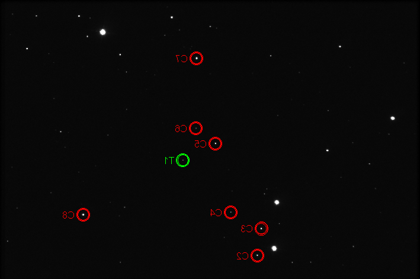

ey-UMa-plans
============

Add things that need to be done on this project as issues.

The comparison stars to use are in this images (sorry the numbers are reversed, this view should match what you will see in AstroImageJ.

